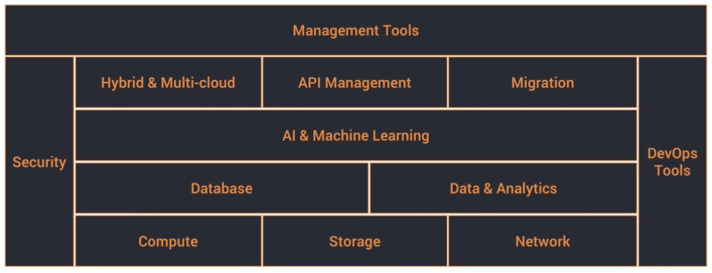
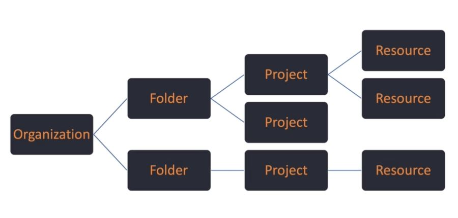
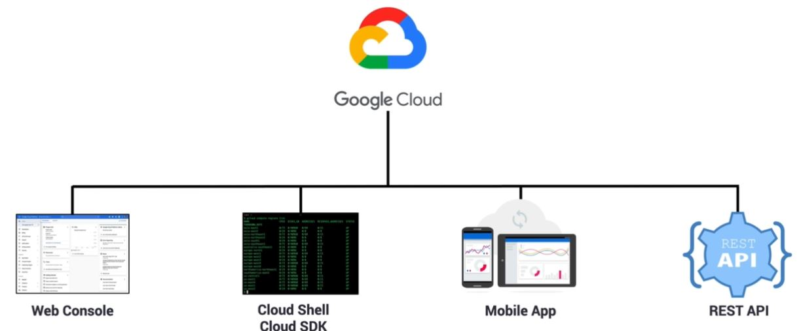
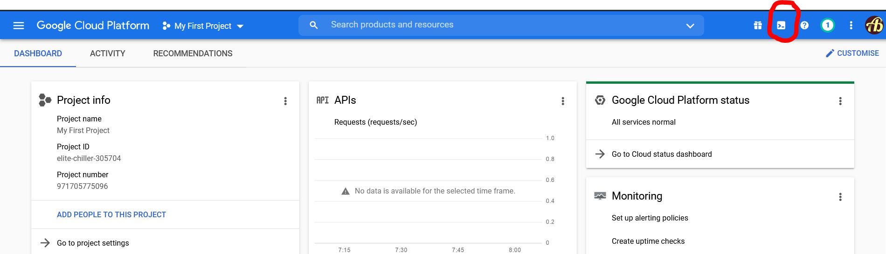
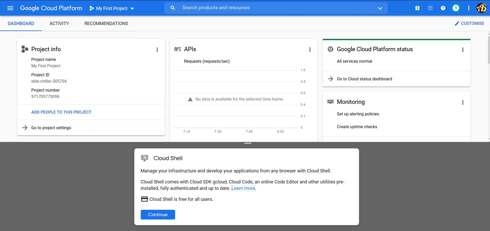
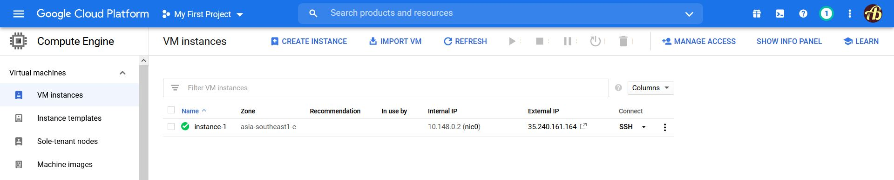
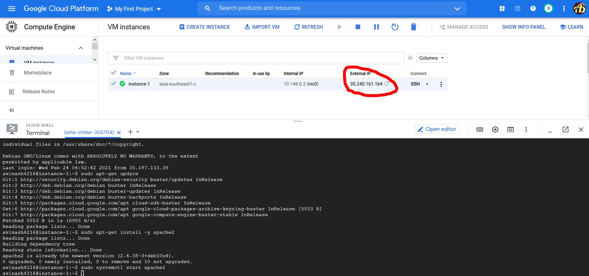
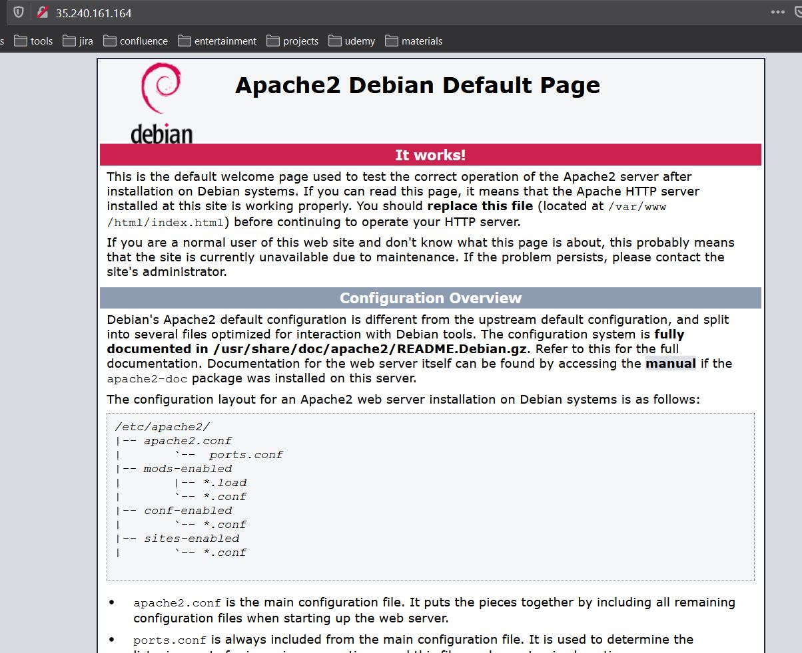
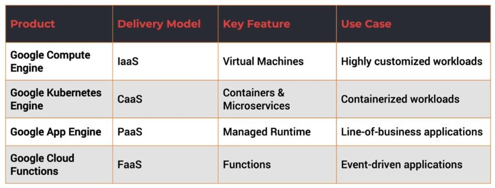

# Notes

# Overview of Google Cloud Platform - GCP 
* GCP has
	* 20 Regions
	* 61 zones
	* 134 network edge locations
	* available in 200+ countries and territories
	* Still expanding
	* For most recent updates on regions, locations etc refer [https://cloud.google.com/about/locations](https://cloud.google.com/about/locations)
	* 1537 (approximately) services
* Zone
	* Data center
	* High availability, reliability, redundancy
	* When application is launched we generally make it available in multiple zones to make application highly available
* Region
	* Collection of multiple data centers
	* 1 Region will have atleast 2 zones
* Network edge locations
	* Delivers static content to enhance user experience
	
# Building blocks of GCP
* Core
	* Compute
	* Storage
	* Network
		* Enables communication across multiple applications and services offered by google
* Databases
	* Sql
	* NoSql
* Data & Analytics
	* Business Intelligence and Data warehouse
* AI & Machine Learning
* Hybrid & Multi-cloud
* API Management
* Migration
	* To migrate work loads from on premises to cloud
* Security
* Devops Tools
* Management Tools
	* Services through which customers can interact and manage their deployments


# Key GCP services
* Compute
	* Compute Engine - GCE - Google Compute Engine
		* IaaS - Infrastructure as a Service
		* Similar to AWS EC2
	* App Engine - GAE - Google App Engine
		* PaaS
	* Kubernetes Engine - GKE - Google Kubernetes Engine
		* CaaS - Container as a Services
	* Container Registry
		* Manages docker container images
	* Cloud Functions
		* Similar to AWS Lambda
* Storage and databases
	* Cloud storage
	* Cloud Bigtable
	* Cloud datastore
	* Cloud Sql
	* Cloud spanner
	* Persistent disk
* Network
	* Cloud virtual network
		* Hybrid and isolated network capabilities within the public cloud
	* Cloud load balancing
		* Routes the traffic across multiple instance of the application
	* Cloud CDN
	* Cloud interconnect
	* Cloud DNS
* Security & Identity
	* Cloud IAM
	* Cloud resource manager
	* Cloud security scanner
	* Cloud platform security
* AI & Machine Learning
	* Cloud machine learning
	* Vision API
	* Speech API
	* Natural language API
	* Translation API
	* Jobs API
* Devops tools - provides automation capabilities
	* Cloud SDK
	* Deployment manager
	* Cloud source repositories
	* Cloud tools for android studio
	* Cloud tools fo IntelliJ
	* Powershell cloud tools
	* Virtual studio cloud tools
	* Plugin for eclipse
	* Cloud test lab
* Management tools - provides insights to existing deployments
	* Stackdriver
	* Monitoring
	* Logging
	* Error reporting
	* Trace
	* Debuggger
	* Deployment manager
	* Cloud endpoints
	* Cloud console
	* Cloud shell
	* Cloud machine app
	* Billing app
	* Cloud APIs

# Other GCP services
* API analytics
* IOT core
* VPN
* AutoML
* Transfer appliance
* Beyond corp
* File store
* Memory store

# Get started with GCP
* Open url - [https://cloud.google.com/free](https://cloud.google.com/free)
* Click on `Get started for free` button
* We need to give credit card information for signup
* Google charges minimal amount on credit card and that will be refunded
* Once signup, we will be naviated to `Google cloud platform console`

# Set an alert on billing
* Click on menu icon on top left
* Click `Billing` link
* Click on `Budgets & alerts` link in left menu
* Click on `CREATE BUDGET` link
* Follow the instruction to create alert

# GCP platform resources
* Anything we launch is creation of resource like
	* GCE VMs
	* Cloud pub/sub topics
	* cloud storage buckets
	* etc
* Reources belong to project
* In GCP project directly represents the billable unit. Any resource we launch is associated with project. Every resource under project is directly billed
* Projects may be organized into folders
	* We can have multiple projects under Dev, Test, Prod
* Each project can be associated with different credit card
* Folder may belong to one and only one organization. This is optional
* Organization is top level entity in GCP hierarchy
* Organization will be available only if we have `GSuite` account
* GCP resources hierarchy


# Interactive with GCP
* Web console
	* Front end GUI
* Cloud shell, cloud SDK
	* For devops engineers
	* comes with `CLI`
	* Cloud SDK can be installed in windows, linux, mac machines
	* Cloud shell is terminal built into the browser. Without installing anything we can quickly interact with GCP
* Mobile App
* REST API


# Accesing GCP shell
* Interactive shell environment for GCP
* Accessible from web browser
* Comes preloaded with `IDE, gcloud SDK` and other tools
* Backed by GCE VM comes with 5 GB of disk storage
* In-built web preview functionality
	* If we launch an application on any port. we will be able to access that by clicking button in cloud shell environment

# Interacting with GCP using cloud shell
* Signin to GCP console - [https://cloud.google.com/free](https://cloud.google.com/free)
* Click `Actiave Cloud Shell` icon on top right corner

* Cloud shell display below popup

* Click `Continue` button
* Execute following command
```
gcloud compute regions list
```
* GCP shell commands - refer [commands.md#gshell-commands](commands.md#gshell-commands)

# Google compute services
* Code is deployed and executed in one of the compute services
* GCP offers following compute services
	* App Engine - GAE
		* PaaS - Platform as a Service
	* Compute Engine - GCE
		* IaaS - Infrastructure as a Service
	* Kubernetes Engine - GKE
		* Orchestration platform
		* To manage containers
	* Cloud Functions
		* FaaS - Functions as a Service
		* Serverless environment to execute where we don't need to launch VM or package our code

# App Engine
* PaaS
* First service lauched by Google
* Fully managed platform for deploying web app at scale
	* When traffic increases App Engine automatically scale the application
* Supports to multiple languages, frameworks and libraries
* Available in 2 environments
	* Standard
	* Flexible
* Application deployed in `standard` environment run in a sandbox. There are some limitations in standard environment
* If we want more control, decide what configurations for our application, what dependencies need to be installed and have complete control on packaging and deployment then we have to use `Flexible` environment.
	* This environment uses Docker containers
* App engine environments dos - [https://cloud.google.com/appengine/docs/the-appengine-environments](https://cloud.google.com/appengine/docs/the-appengine-environments)

# GCE Google Compute Engine
* IaaS - Infrastructure as a Service
* Enables to lauch Linux and windows virtual machines
* VMs are based on machine types with various CPU and RAM configurations

# GKE Google Kubernetes Engine
* CaaS - Container as a Service
* Managed environment for deploying containerized applications managed by kubernetes
* Bring in container images, package them as kubernetes artifacts, deploy them, scale them through GKE
* Kubernetes has control panel and worker node
* GKE provisions worker node as GCE VMs
* This service is tightly integrated with GCP resources such as network, storage and monitoring
	* For example if we expose service using GKE it will be using load balancer
	* GKE infrastructure is monitored by `stackdriver`
* Auto scaling
* Automatic upgrades
* Auto repair of nodes

# Google Cloud Functions
* Serverless executing environment for connecting and building cloud services
* Serverless compute environments excute code in response to an event
* We write code as function which has entry point and exit point
* Cloud Functions supports Javascript, Python 3, Go
* GCP events fire cloud functions through a trigger
	* Trigger connects external resource to cloud function
* One classic example of cloud function is
	* Creating a thumbnail whenever image uploaded to cloud storage
	* Uploading image to cloud storage is an event. This triggers cloud function which generates thumbnail using image library/API
* Triggers connect event to function
	* Define an event
	* Connect it to the funciton
	* Every time event occured Trigger will invoke a function

# Launching GCE instance
* Signin to GCP console
* Left menu
	* Compute Engine
		* click `VM instances`
* Click `Create` button
* Give instance name. Ex: `instance-1`
* Select Region. Ex: `asia-south1(Mumbai)`
* Select Zone. Ex: `asia-south1-a`
* Machine configuration
	* Select `Machine type` - `e2-micro` to be free limit
* Firewall
	* Check `Allow HTTP traffic`
* Click `Create` button
* This will take some time. Once VM is launched we can see Green tick

* Check list of compute instances using gcp shell
```
gcloud compute instances list
```
* Connect to GCE VM instance via SSH
```
gcloud compute ssh instance-1 --zone asia-southeast1-c
```
* Update the packages in linux VM
```
sudo apt-get update
```
* Install apache2
```
sudo apt-get install -y apache2
```
* Start apache2
```
sudo systemctl start apache2
```
* Click `External IP`

* Result


# Use cases for GCP compute services
* 